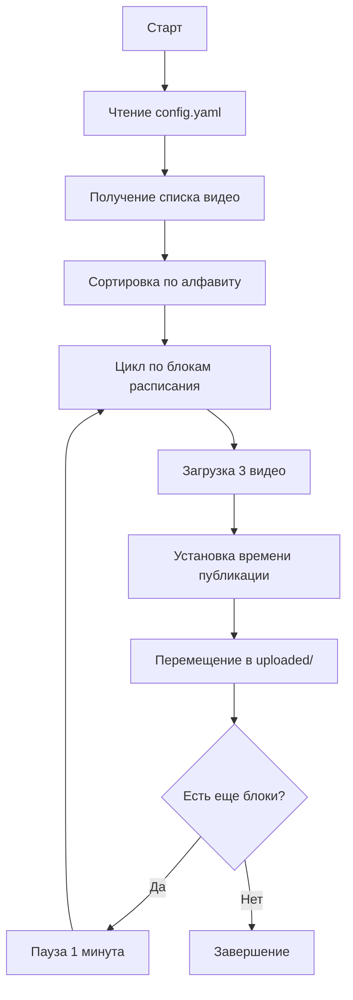

```markdown
YouTube Auto Uploader — это инструмент для автоматизации публикации видеоконтента на YouTube. Скрипт читает конфигурацию из YAML-файла и последовательно загружает видео с отложенной публикацией по заданному расписанию.

Основные возможности:
✅ Пакетная загрузка до 15 видео за один запуск
✅ Гибкое расписание — по 3 ролика в день в указанное время
✅ Индивидуальные настройки для каждого блока: теги, описание, категория, приватность
✅ Поддержка нескольких каналов через разные токены авторизации
✅ Автоматическое перемещение загруженных файлов в папку uploaded/
✅ Подробное логирование всех действий

### ⚙️ Гибкая настройка
- 🕐 Индивидуальное время для каждого блока
- 🏷️ Свои теги и описания
- 📂 Автоматическое перемещение файлов
- 🎬 Любые форматы видео (MP4, MOV, AVI)
- 🔒 Статусы: public/private/unlisted
---

## 🚀 Быстрый старт

```bash
# 1. Клонировать репозиторий
git clone https://github.com/yourusername/youtube-uploader.git
cd youtube-uploader

# 2. Установить зависимости
pip install -r requirements.txt

# 3. Добавить client_secrets.json (см. раздел ниже)

# 4. Запустить
python uploader.py
```

---

## 📦 Установка

### Требования

- **Python** 3.8 или выше
- **Google Cloud** аккаунт
- **YouTube** канал

### Структура проекта

```
youtube-uploader/
├── 📄 uploader.py              # Основной скрипт
├── 📄 config.yaml              # Конфигурация загрузки
├── 📄 client_secrets.json      # OAuth credentials (ваш)
├── 📄 requirements.txt         # Зависимости Python
├── 📄 upload_log.txt           # Лог (создается автоматически)
├── 📁 videos/                  # Папка с видео для загрузки
│   └── 📁 uploaded/            # Загруженные видео
└── 📄 README.md                # Документация
```

### Установка зависимостей

```bash
pip install -r requirements.txt
```

**Содержимое `requirements.txt`:**
```text
google-api-python-client
google-auth-oauthlib
google-auth
PyYAML
pytz
```

---

## 🔐 Настройка Google API

### Шаг 1: Создание проекта в Google Cloud

1. Перейдите на [Google Cloud Console](https://console.developers.google.com/)
2. Создайте новый проект (например, "YouTube Uploader")
3. Включите **YouTube Data API v3**:
   - Перейдите в "Library"
   - Найдите "YouTube Data API v3"
   - Нажмите "Enable"

### Шаг 2: Создание OAuth credentials

1. Перейдите в **Credentials**
2. Нажмите **Create Credentials → OAuth Client ID**
3. Выберите тип: **Desktop Application**
4. Скачайте JSON файл
5. Переименуйте в `client_secrets.json`
6. Поместите в корень проекта

> ⚠️ **Важно:** Убедитесь, что в файле есть секция `"installed"`, а не `"web"`

### Шаг 3: Настройка тестового режима

1. В Google Cloud Console перейдите в **OAuth consent screen**
2. Выберите тип: **External** (Внешний)
3. Заполните обязательные поля:
   - App name
   - User support email
   - Developer contact email
4. Во вкладке **Test users** добавьте email вашего Google аккаунта

> 💡 **Совет:** С типом "External" не нужно проходить проверку Google, и вы можете использовать API в тестовом режиме с 100 тестовыми пользователями.

### Шаг 4: Первая авторизация

```bash
python uploader.py
```

1. Откроется браузер
2. Войдите в Google аккаунт (который добавлен в тестовые пользователи)
3. Выберите YouTube канал
4. Нажмите **"Разрешить"**
5. Файл `token.pickle` будет создан автоматически

---

## 📄 Конфигурация

### Базовая структура `config.yaml`

```yaml
# Использовать общие параметры для всех видео
use_default_params: false

# Параметры по умолчанию (если use_default_params: true)
default_params:
  category_id: "22"
  privacy_status: "private"
  made_for_kids: false
  tags: ["youtube", "video"]

# Расписание загрузки
schedule:
  - date: "2025-06-10"
    time: "12:00"
  - date: "2025-06-11"
    time: "14:00"
  - date: "2025-06-12"
    time: "16:00"

# Настройки для каждого видео
videos:
  - title: "Первое видео"
    description: "Описание первого видео"
    tags: ["вб", "одежда"]
    category_id: "22"
    made_for_kids: false

  - title: "Второе видео"
    description: "Описание второго видео"
    tags: ["музыка", "стиль"]
    category_id: "10"
    made_for_kids: true

  - title: "Третье видео"
    description: "Описание третьего видео"
    tags: ["обзор", "техника"]
    category_id: "28"
    made_for_kids: false
```

### Альтернативная структура (с блоками)

```yaml
blocks:
  - schedule:  # блок для первых 3 видео
      date: "2025-06-10"  # дата загрузки
      time: "12:00"  # время
    settings:  # настройки
      category_id: "22"  # категория
      privacy_status: "private"  # приват или паблик
      tags: ["вб", "одежда"]  # теги видео
      made_for_kids: false  # настройка видео для детей? да/нет

  - schedule:  # блок для следующих 3 видео
      date: "2025-06-11"
      time: "14:00"
    settings:
      category_id: "10"
      privacy_status: "public"
      tags: ["музыка", "стиль"]
      made_for_kids: true
```

### Параметры конфигурации

| Параметр | Тип | Описание | Пример |
|----------|-----|----------|--------|
| `title` | string | Название видео | `"Мой первый ролик"` |
| `description` | string | Описание видео | `"Привет! Это описание..."` |
| `tags` | list | Теги видео | `["python", "youtube"]` |
| `category_id` | string | ID категории YouTube | `"22"` (People & Blogs) |
| `privacy_status` | string | Статус приватности | `"public"`, `"private"`, `"unlisted"` |
| `made_for_kids` | boolean | Видео для детей? | `true` / `false` |
| `date` | string | Дата публикации | `"2025-06-10"` |
| `time` | string | Время публикации | `"12:00"` |

### Популярные category_id

| ID | Категория | ID | Категория |
|----|-----------|----|-----------|
| 1 | Film & Animation | 20 | Gaming |
| 2 | Autos & Vehicles | 22 | People & Blogs |
| 10 | Music | 23 | Comedy |
| 15 | Pets & Animals | 24 | Entertainment |
| 17 | Sports | 25 | News & Politics |
| 26 | Howto & Style | 27 | Education |
| 28 | Science & Technology | 29 | Nonprofits & Activism |

---

## 💡 Примеры конфигурации

### Пример 1: Загрузка 3 видео в один день

```yaml
use_default_params: true

default_params:
  category_id: "22"
  privacy_status: "private"
  made_for_kids: false
  tags: ["auto", "upload"]

schedule:
  - date: "2025-06-10"
    time: "18:00"

videos:
  - title: "Урок 1: Введение"
    description: "Первый урок курса"
    tags: ["обучение", "курс"]

  - title: "Урок 2: Основы"
    description: "Второй урок курса"
    tags: ["обучение", "курс"]

  - title: "Урок 3: Практика"
    description: "Третий урок курса"
    tags: ["обучение", "курс"]
```

### Пример 2: Многодневная загрузка

```yaml
use_default_params: false

schedule:
  - date: "2025-06-10"
    time: "12:00"
  - date: "2025-06-11"
    time: "14:00"
  - date: "2025-06-12"
    time: "16:00"
  - date: "2025-06-13"
    time: "18:00"
  - date: "2025-06-14"
    time: "20:00"

videos:
  - title: "День 1: Видео 1"
    description: "Описание"
    tags: ["день1"]
    category_id: "22"
    made_for_kids: false

  - title: "День 1: Видео 2"
    description: "Описание"
    tags: ["день1"]
    category_id: "22"
    made_for_kids: false

  - title: "День 1: Видео 3"
    description: "Описание"
    tags: ["день1"]
    category_id: "22"
    made_for_kids: false

  - title: "День 2: Видео 1"
    description: "Описание"
    tags: ["день2"]
    category_id: "10"
    made_for_kids: true

  # ... и так далее до 15 видео
```

---

## 📊 Как это работает

### Алгоритм работы



### Ограничения YouTube API

⚠️ **Важно знать:**

| Ограничение | Значение |
|-------------|----------|
| Дневной лимит YouTube API | 10,000 единиц квоты |
| Загрузка одного видео | ~1,600 единиц квоты |
| Максимум видео в день | ~6 видео (10,000 ÷ 1,600) |
| Отложенная публикация | минимум за 2 часа до публикации |
| Максимальный размер файла | 256 GB |
| Поддерживаемые форматы | MP4, MOV, AVI, WMV, FLV, WebM |

---

## 📁 Структура файлов

```
project/
├── uploader.py              # Основной скрипт
├── config.yaml              # Конфигурация загрузки
├── client_secrets.json      # OAuth credentials
├── token.pickle             # Токен авторизации (создается автоматически)
├── requirements.txt         # Зависимости Python
├── upload_log.txt           # Лог загрузки (создается автоматически)
├── videos/                  # Папка с видео для загрузки
│   ├── uploaded/            # Папка для загруженных видео
│   ├── video1.mp4
│   ├── video2.mp4
│   └── video3.mp4
└── README.md                # Документация
```

---

## 📊 Логирование

Все действия записываются в файл `upload_log.txt`:

```
2025-06-10 12:00:15 - --- Блок #1: 2025-06-10T12:00:00+05:00 ---
2025-06-10 12:00:20 - ✅ Видео 'Первое видео' загружено: abc123xyz
2025-06-10 12:00:25 - ✅ video1.mp4 перемещено в 'uploaded'
2025-06-10 12:00:30 - ✅ Видео 'Второе видео' загружено: def456uvw
2025-06-10 12:00:35 - ✅ video2.mp4 перемещено в 'uploaded'
```

---

## 🔧 Запуск скрипта

### Базовый запуск

```bash
python uploader.py
```

### Запуск с указанием токена

```bash
python uploader.py token_channel2.pickle
```

### Запуск в фоновом режиме (Linux/Mac)

```bash
nohup python uploader.py > output.log 2>&1 &
```

### Запуск в фоновом режиме (Windows)

```bash
start /B python uploader.py
```

---

## ⚠️ Troubleshooting

### Ошибка: `HttpError 403 - quotaExceeded`

**Причина**: Превышен дневной лимит YouTube API

**Решение**: 
- Подождите до следующего дня (квота обновляется в 00:00 по тихоокеанскому времени)
- Запросите увеличение квоты в Google Cloud Console

### Ошибка: `HttpError 403 - accessNotConfigured`

**Причина**: YouTube Data API v3 не включен

**Решение**: 
- Перейдите в Google Cloud Console
- Включите **YouTube Data API v3** для вашего проекта

### Ошибка: `HttpError 401 - invalidCredentials`

**Причина**: Токен авторизации истек или недействителен

**Решение**: 
- Удалите файл `token_*.pickle`
- Запустите скрипт заново для повторной авторизации

### Ошибка: `HttpError 400 - badRequest`

**Причина**: Неправильные параметры в config.yaml

**Решение**: 
- Проверьте формат даты и времени
- Убедитесь, что `category_id` указан как строка (в кавычках)
- Проверьте, что время публикации минимум на 2 часа в будущем

### Видео не публикуется по расписанию

**Причина**: Видео загружено менее чем за 2 часа до запланированного времени

**Решение**: 
- YouTube требует минимум 2 часа между загрузкой и публикацией
- Планируйте загрузку заранее

### Ошибка: `FileNotFoundError: client_secrets.json`

**Причина**: Файл OAuth credentials отсутствует

**Решение**: 
- Скачайте `client_secrets.json` из Google Cloud Console
- Поместите его в корневую папку проекта

---

## 💡 Советы по использованию

### 1. Именование файлов

Используйте нумерацию для порядка загрузки:

```
001_intro.mp4
002_main.mp4
003_outro.mp4
```

### 2. Тестовый запуск

Сначала загрузите 1-2 видео в приватном режиме, чтобы убедиться, что все работает правильно.

### 3. Резервное копирование

Сохраняйте `config.yaml` и токены в безопасном месте.

### 4. Мониторинг

Проверяйте `upload_log.txt` после каждого запуска для отслеживания статуса загрузки.

### 5. Квота API

Планируйте загрузку с учетом дневного лимита:
- Максимум 6 видео в день
- Распределяйте загрузку на несколько дней при необходимости

---

## 📝 Лицензия

Этот проект предоставляется "как есть" для образовательных целей.

MIT License

---

## 🤝 Поддержка

Если у вас возникли вопросы или проблемы:

1. Проверьте раздел [Troubleshooting](#-troubleshooting)
2. Изучите `upload_log.txt` для диагностики
3. Убедитесь, что все зависимости установлены
4. Проверьте квоту YouTube API в Google Cloud Console

---

<div align="center">

**Удачной загрузки! 🎥✨**

[⬆ Вернуться к началу](#-youtube-auto-uploader)

</div>
```
